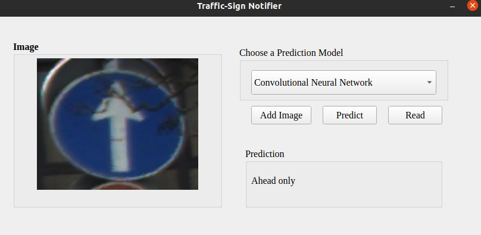

# Traffic Sign Recognition

## Main Purpose:
Train a model to recognize traffic signs using with Convolutional Neural Network. 

 

### Problem and Motivation : 

Indicating traffic signs is important for the safety of people.
Ignoring or not paying attention to traffic signs can cause
traffic accidents directly or indirectly. Therefore, drivers
will benefit from a system that automatically detects and
recognizes traffic signs. Thus, the driver's rule violations
and possible traffic accidents due to reasons such as lack of
attention and fatigue are prevented.

# Dataset

The German Traffic Sign Recognition Benchmark (GTSRB) was used as the data set in the project. The data set we use in the project can be accessed via Kaggle. GTSRB consists of more than 50,000 images. Each image has 3 channels in RGB and the width and height values are different. There are 39209 images in the exercise data set and 12630 images in the test data set. There are 43 different classes in the data set. Each image is mapped to a class. Info:

- Single-image, multi-class classification problem
- 43 classes
- More than 50,000 images in total
- Large, lifelike database

<a href= "https://benchmark.ini.rub.de/">INI Benchmark Website</a> 
<a href="https://www.kaggle.com/meowmeowmeowmeowmeow/gtsrb-german-traffic-sign" target='blank_' alt='Dataset link' > Dataset Link on Kaggle </a> 

# Install & run

Apply the steps are below: 
1. pip3 install -r requirements.txt
2. python3 runner.py
3. python3 main.py

 
Note: docker version & web ui version will be added in time 